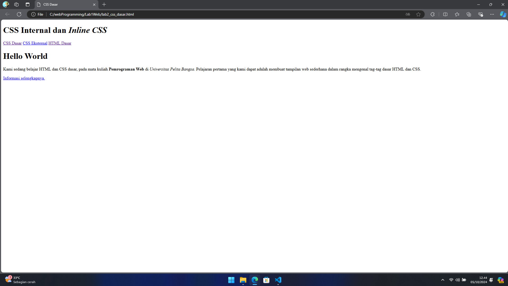
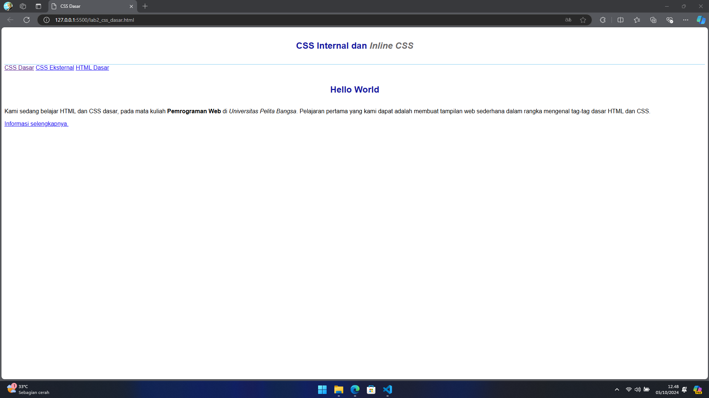
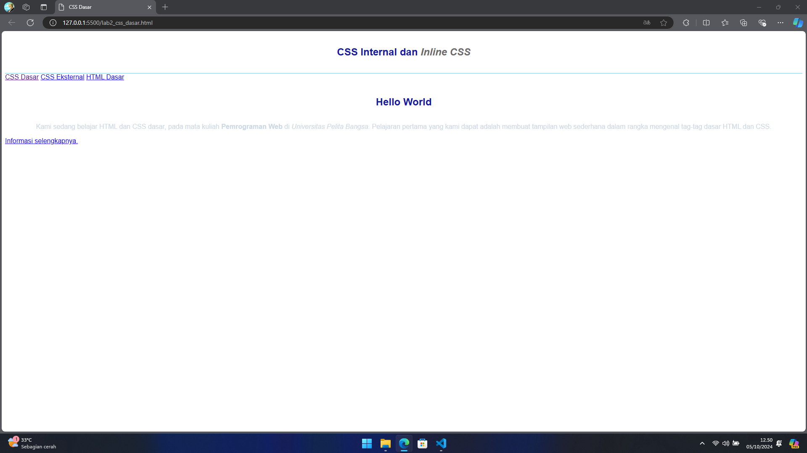
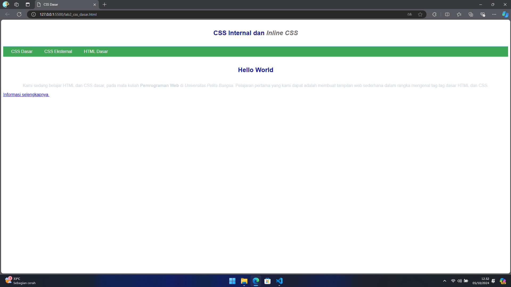
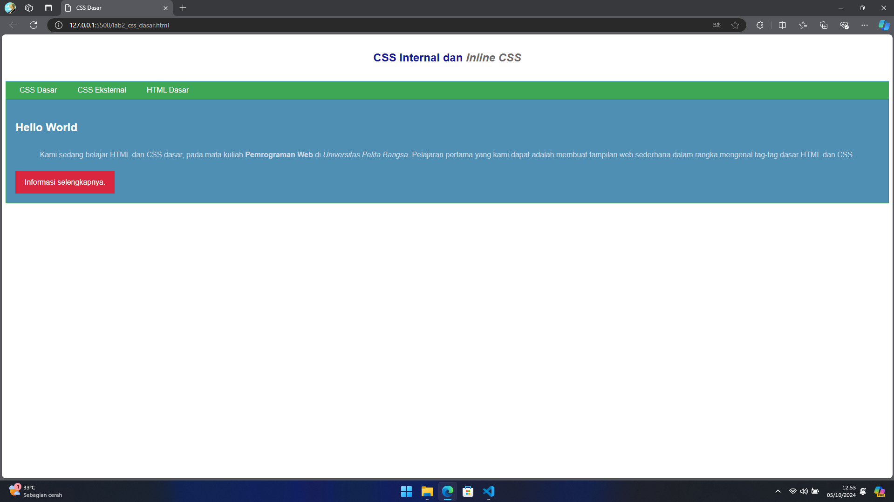

# Lab2Web
## Belajar CSS dasar

### Membuat dokumen HTML
```<!DOCTYPE html>
<html lang="en">

<head>
    <meta charset="UTF-8">
    <meta name="viewport" content="width=device-width, initial-scale=1.0">
    <title>CSS Dasar</title>
</head>

<body>
    <header>
        <h1>CSS Internal dan <i>Inline CSS</i></h1>
    </header>
    <nav>
        <a href="lab2_css_dasar.html">CSS Dasar</a>
        <a href="lab2_css_eksternal.html">CSS Eksternal</a>
        <a href="lab1_tag_dasar.html">HTML Dasar</a>
    </nav>
    <!-- CSS ID Selector -->
    <div id="intro">
        <h1>Hello World</h1>
        <p>Kami sedang belajar HTML dan CSS dasar, pada mata kuliah <b>Pemrograman
                Web</b> di <i>Universitas Pelita Bangsa</i>. Pelajaran pertama yang kami dapat
            adalah membuat tampilan web sederhana dalam rangka mengenal tag-tag dasar HTML
            dan CSS.</p>
        <!-- CSS Class Selector -->
        <a class="button btn-primary" href="#intro">Informasi selengkapnya.</a>
    </div>
</body>

</html>
```


### Mendeklarasikan CSS internal
```<head>
    <title>CSS Dasar</title>
    <style>
        body {
            font-family: 'Open Sans', sans-serif;
        }

        header {
            min-height: 80px;
            border-bottom: 1px solid #77CCEF;
        }

        h1 {
            font-size: 24px;
            color: #0F189F;
            text-align: center;
            padding: 20px 10px;
        }

        h1 i {
            color: #6d6a6b;
        }
    </style>
</head>
```


### Menambahkan inline CSS
```<p style="text-align: center; color: #ccd8e4;"></p>
```


### Membuat CSS Eksternal
```nav {
    background: #20A759;
    color: #fff;
    padding: 10px;
}

nav a {
    color: #fff;
    text-decoration: none;
    padding: 10px 20px;
}

nav .active,
nav a:hover {
    background: #0B6B3A;
}
```
Kemudian tambahkan tag `<link>` untuk merujuk file CSS yang sudah dibuat pada bagian `<head>`
```<head>
    <!-- menyisipkan css eksternal -->
    <link rel="stylesheet" href="style_eksternal.css" type="text/css">
</head>
```


### Menambahkan CSS selector
```/* ID Selector */
#intro {
    background: #418fb1;
    border: 1px solid #099249;
    min-height: 100px;
    padding: 10px;
}

#intro h1 {
    text-align: left;
    border: 0;
    color: #fff;
}

/* Class Selector */
.button {
    padding: 15px 20px;
    background: #bebcbd;
    color: #fff;
    display: inline-block;
    margin: 10px;
    text-decoration: none;
}

.btn-primary {
    background: #E42A42;
}
```
